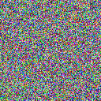

## TUDCTF 25 - Just Noise
Category: Reversing

Description:
```
I found a USB stick tucked behind the parmesan cheese grater at Mama Mia's Italian Restaurant with two files: gen_simple.c and out.zip - figure out how they work together to reveal Nonna's secret recipe!
```
---
### Walkthrough
We are given two things:
* `gen_simple.c` - A C program
* `out.zip` - Containing a folder full of noisy images

Each image hides exactly one character of the flag.
So our job is to:
1. Find where the character is hidden
2. Undo any encryption/encoding
3. Put all the character together

#### Step 1: Understanding the images
To extract the folder we can just simply use the `unzip` command. 
```
$ unzip out.zip
```

Listing the contents (using `ls`) shows many numbered images 
```
$ ls out/
img_000.ppm  img_005.ppm  img_010.ppm  img_015.ppm  img_020.ppm  img_025.ppm  img_030.ppm  img_035.ppm
img_001.ppm  img_006.ppm  img_011.ppm  img_016.ppm  img_021.ppm  img_026.ppm  img_031.ppm  img_036.ppm
img_002.ppm  img_007.ppm  img_012.ppm  img_017.ppm  img_022.ppm  img_027.ppm  img_032.ppm  img_037.ppm
img_003.ppm  img_008.ppm  img_013.ppm  img_018.ppm  img_023.ppm  img_028.ppm  img_033.ppm
img_004.ppm  img_009.ppm  img_014.ppm  img_019.ppm  img_024.ppm  img_029.ppm  img_034.ppm
```

Checking one file using `file`:
```
$ file out/img_000.ppm
out/img_000.ppm: Netpbm image data, size = 128 x 128, rawbits, pixmap
```
These are PPM images, an image format that stores raw pixel data. Each image is only 128 by 128, making them small enough to process with code.

If you open one of them, it will look like pure noise.



Not very useful.

#### Step 2: Understanding `gen_simple.c`

This program creates the images in `out.zip`. By looking through it carefully, we can reverse everything it does.

The important idea here is that:
> **Each image hides exactly ONE character of the flag.**

The image number (`img_000`, `img_001`, etc.) tells us which character of the flag it contains.
 
---
### Stage 1: Filling image with noise
```C
/* tiny LCG to fill the image with random bytes (state seeded by index) */
static uint32_t lcg_step(uint32_t *s){
*s = (*s * 1664525u + 1013904223u);
return *s;
}
static uint8_t rnd8(uint32_t *s){ return (uint8_t)(lcg_step(s) >> 24); }
```
This code generates fake randomness using a simple formula (a Linear Congruential Generator).

Later in `main()`:
```C
uint32_t s = (uint32_t)(i + 1);
for (size_t k = 0; k < img_bytes; k++) buf[k] = rnd8(&s);
```

In essence:
1. Each image starts being filled with random colors
2. Randomness depends on the image index `i`
3. The noise hides the real data visually

We dont need to regenerate the nosie to solve this however.


### Stage 2: Where to hide the character

```C
/* deterministic per-index position (no seed) */
static void choose_pos(size_t idx, int w, int h, int *x, int *y){
    /* use 64-bit math to avoid overflow for larger idx */
    uint64_t i = (uint64_t)idx;
    uint64_t xx = (i*73u + i*i*19u + 17u) % (uint64_t)w;
    uint64_t yy = (i*131u + i*i*7u + 23u) % (uint64_t)h;
    *x = (int)xx;
    *y = (int)yy;
}
```
Here, the `choose_pos()` function decides which pixel will store the character.

Things to consider:
1. Position depends on the image index `i`
2. `% w` and `% h` ensure the position stays inside the image
3. Its deterministic, same image index will always produce the same (x, y)

We will use these formula for reversing.


### Stage 3: Caesar Cipher Rotation
```C
/* per-index rotation amount 0..25 (no seed) */
static int rot_for_idx(size_t idx){
    uint64_t i = (uint64_t)idx;
    return (int)((i*7u + i*i*3u + 5u) % 26u);
}
```
This calculates how much each character is shifted in the alphabet.


Then the rotation is applied
```C
/* Caesar rotate only letters */
static unsigned char rot_char(unsigned char c, int r){
    if (c >= 'A' && c <= 'Z') return (unsigned char)('A' + ((c - 'A' + r) % 26));
    if (c >= 'a' && c <= 'z') return (unsigned char)('a' + ((c - 'a' + r) % 26));
    return c; // non-letters unchanged
}
```
This is Caeser Cipher, meaning:
1. Letters are shifted forward
2. Non-letters (numbers, spaces, etc.) are unchanged

To reverse this, we simply rotate backwards by the same amount.

### Stage 4: Store character in the image
```C
size_t off = ((size_t)y * (size_t)W + (size_t)x) * 3;
buf[off + 0] = rc;  // R channel holds the rotated ASCII
```
Each pixel has three bytes:
```
[RED | GREEN | BLUE]
```
The C program stores the rotated character at:
1. The pixel (x, y)
2. In the red channel only

If you try to view the image there will be no apparent difference.

### Stage 5: Write to PPM File
```C
fprintf(f, "P6\n%d %d\n255\n", W, H);
fwrite(buf, 1, img_bytes, f);
```

The PPM format is pretty simple: 
1. Write a header (P6 means it's a color image in binary format, then the width and height, then 255 for max color value), 
2. Followed by dumping all the pixel data. Each image gets a numbered filename like img_000.ppm, img_001.ppm, etc., so you know what order to read them in when decoding.


## Step 3: Reversing the Process

So in order for us to retrieve the flag, we need to:
1.  Loop through all images in order
    `img_000.ppm`, `img_001.ppm`, `img_002.ppm`, ...
2. Replicate the `choose_pos()` function using the index $i$ to determine the exact $(x, y)$ coordinates where the secret character is stored in the current image.
  
    - $$x = (i \cdot 73 + i^2 \cdot 19 + 17) \pmod{128}$$
    - $$y = (i \cdot 131 + i^2 \cdot 7 + 23) \pmod{128}$$

    This tells us exactly which pixel contains the hidden data.

3. Extract the Rotated Character: Open the image and read the color value from the Red channel (the first channel, index 0) at the calculated $(x, y)$ coordinates. This value, $rc$, is the rotated ASCII character.

    `rc` = rotated character (still encrypted)


4. Replicate the `rot_for_idx()` function using the index $i$ to determine the original Caesar cipher shift $r$ applied to the character.

    - $$r = (i \cdot 7 + i^2 \cdot 3 + 5) \pmod{26}$$
    
5. Apply the reverse Caesar cipher shift to $rc$ to get the original character $c$. Rotating backwards by `r` is the same as rotating forward by `26-r`. For example, if a character was rotated by `3`, we rotated it backward by `3` (or forward by `23`)

6. Append the recovered character $c$ to the final flag string.

### Script to solve
Using the listed above requirements we can use this script to reverse every stage.

```python
import os
from PIL import Image

W = 128
H = 128

def choose_pos(idx, W, H):
    i = idx
    x = (i*73 + i*i*19 + 17) % W
    y = (i*131 + i*i*7 + 23) % H
    return x, y

def rot_for_idx(idx):
    i = idx
    return (i*7 + i*i*3 + 5) % 26

def rot_char(c, r):
    if 'A' <= c <= 'Z':
        return chr((ord(c)-ord('A')+r)%26 + ord('A'))
    if 'a' <= c <= 'z':
        return chr((ord(c)-ord('a')+r)%26 + ord('a'))
    return c

def unrot_char(c, r):
    return rot_char(c, 26 - r)


images = sorted(os.listdir("out/"))
flag = ""

for fname in images:
    idx = int(fname.split("_")[1].split(".")[0])
    img = Image.open(os.path.join("out/", fname))
    x, y = choose_pos(idx, W, H)
    rc = img.getpixel((x, y))[0]  # red channel
    flag += unrot_char(chr(rc), rot_for_idx(idx))

print("Flag:", flag)
```

Running the script will give us the flag
```
$ python3 script.py
Flag: TUDCTF{R3dCh4nn3l_C43s4r_1n_Tr4tt0r14}
```

### Final Flag
```
TUDCTF{R3dCh4nn3l_C43s4r_1n_Tr4tt0r14}
```

Voila! Ta-da! Presto! ^_^
